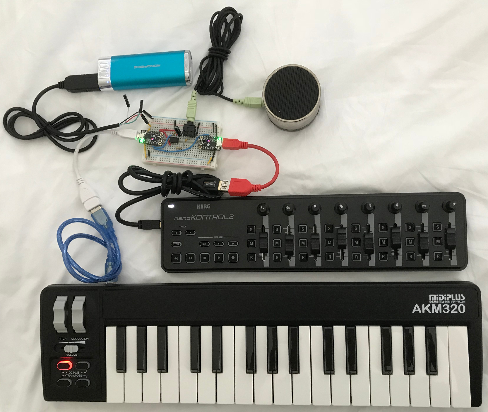

# Portable MIDI dsp-G1 Synth



Starting from the top left and going clockwise spiraling into the center, the
blue object is a 5V, 2A USB power bank. To the right is a battery powered
speaker. The dsp-G1 produces monophonic output so a single speaker is fine.
Next is a MIDI control board with 8 knobs, 8 faders, and lots of buttons. Next
is a MIDI keyboard with a volume fader (CC-07) and modulation wheel (CC-01).
The dsp-G1 ignores pitch bend so the pitch bend wheel is not useful. Next is a
breadboard with two Trinket M0s working as USB MIDI to UART MIDI converters.
The MIDI UART signals are are routed with blue wires to the MIDI input of the
dsp-G1. Yellow wires carry 5V power and red wires carry 3.3V power.

The [DSP Synthesizers
dsp-G1](https://dspsynth.eu/webshop/product/dsp-g1-analog-modeling-synthesizer/)
synth on a chip is great but building a control board with 19 knobs for 19 CCs
takes too long. I have a USB MIDI control board so connecting it would be a
quicker way to test drive the dsp-G1.

My vague idea was given a USB MIDI keyboard, a USB MIDI control board, and a
dsp-G1 synth chip, build a battery powered standalone synth. No computer so
this rules out Raspberry Pi solutions. Just plug in, power up, and start
playing.

The solution I came up with uses two Adafruit Trinket M0 boards as USB host to
UART MIDI. The Trinket M0 and the dsp-G1 all operate at 3.3V logic levels on
the same board so there is no need for DIN connectors, opto-isolators, or logic
level shifters.

The Trinket M0 is based on the Microchip SAMD21 so it is very different from
the original Trinket. The original Trinket cannot be used for this project.

## MIDI flow

```
USB MIDI Keyboard -> Trinket M0 1 UART Tx
                                   |
                                   v
USB MIDI nanoKntrl-> Trinket M0 2 UART Rx
                                  UART Tx -> dsp-G1
```

In addition, the default control board CC numbers must be mapped to the ones
required by the dsp-G1 chip. This can easily be handled in software by the
Trinket M0.

Connection table. Pins in rows are connected together.

Power   |Trinket M0 1   |Trinket M0 2   |dsp-G1
------- |-------------- |------------   |------
GND     |GND            |GND            |GND
5V      |USB            |USB            |n/c
n/c     |n/c            |3V             |VDD x 3
n/c     |TX-4           |RX-3           |n/c
n/c     |n/c            |TX-4           |MIDI RX
n/c     |n/c            |n/c            |Audio out

The 5V power source powers both Trinket M0s (TM0s) as well as the MIDI devices
connected to TM0s. The TM0-2 3.3V output powers the dsp-G1 synth chip. If a
MIDI device with lots of LEDs is used, be sure the 5V power source provides
enough current for all devices.

Both TM0s are running the same sketch. If a USB MIDI keyboard with lots of
knobs is plugged into TM0-2, TM0-1 is not needed.

Using different MIDI device will require changes to the sketch if CC numbers
must be changed.

## USB MIDI host to UART

The [USB Host Library for
SAMD](https://github.com/gdsports/USB_Host_Library_SAMD) provides the USB Host
MIDI driver. The library is derived from the [USB Host Shield
Library](https://github.com/felis/USB_Host_Shield_2.0).

The [MIDI for
Arduino](https://github.com/FortySevenEffects/arduino_midi_library) library
provides the MIDI UART driver.
